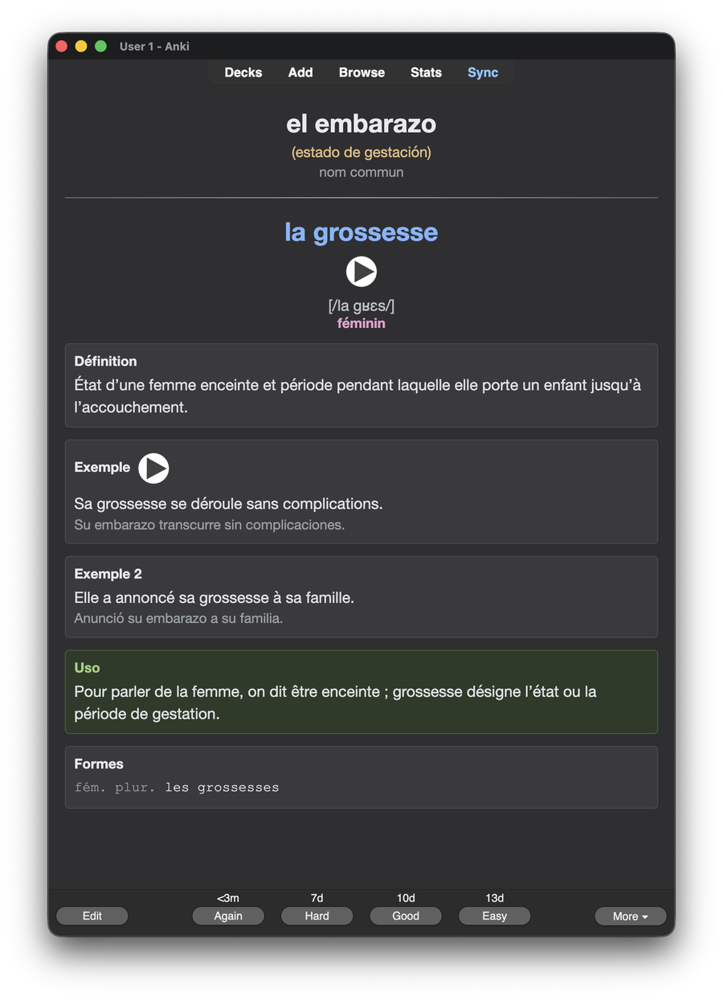
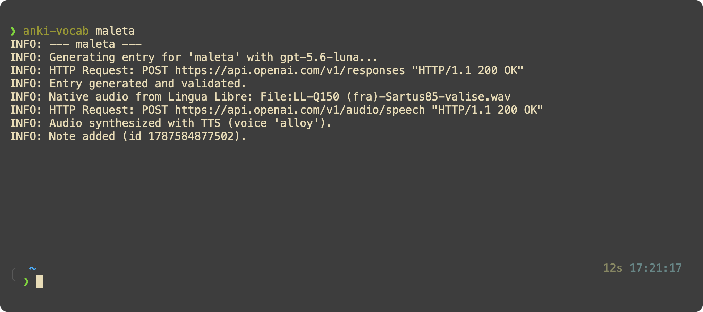
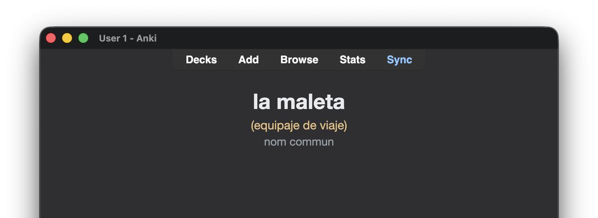
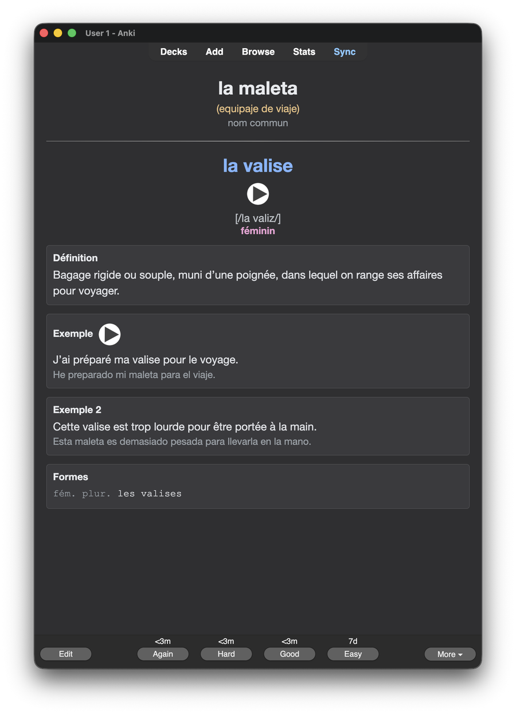

<h1 align="center">anki-vocab</h1>

<p align="center">
  Type a word in your language. Get a finished Anki card in the one you are learning:<br>
  definition, IPA, gender, examples, conjugation, false friends, and native pronunciation.
</p>

<p align="center">
  
</p>

```bash
$ anki-vocab maleta
```

<p align="center">
  
</p>

Most vocabulary tools give you a translation. A translation is the easy half. What
actually stops you speaking is the other half: whether *l'étage* is masculine, that
*se souvenir* takes **de** and conjugates with **être**, that *constipé* does not
mean constipated, that *Je doute que...* wants the subjunctive. This tool puts that
on the card, and fills nothing it cannot fill honestly.

---

## Quick start

Three commands. You need Anki with the
[AnkiConnect](https://ankiweb.net/shared/info/2055492159) add-on (*Tools → Add-ons →
Get Add-ons*, code `2055492159`, then restart Anki) and an
[OpenAI API key](https://platform.openai.com/api-keys).

```bash
uv tool install anki-vocab     # or: pipx install anki-vocab
anki-vocab --setup             # asks for the key, the pair, the deck
anki-vocab maleta              # your first card
```

`--setup` walks through it, checks the key works, writes
`~/.config/anki-vocab/config.yaml`, and creates the deck and note type in Anki for
you:

```
anki-vocab setup
----------------------------------------

  Language pairs available:
    es-de
    es-fr
  Language pair [es-fr]: es-fr

  An OpenAI API key is needed to generate entries.
  API key (leave blank to keep the environment's): ••••••••
  ✓ key accepted

  Decks in Anki: Français, Deutsch
  Anki deck [Vocabulary]: Français
  Note type to create [Vocab v2]: Vocab v2
  Also generate target → source cards? (y/N): n
  Also generate audio-only cards? (y/N): n

  ✓ ~/.config/anki-vocab/config.yaml
  ✓ ~/.config/anki-vocab/.env (readable only by you)
  ✓ deck "Français" and note type "Vocab v2" in Anki
```

Spanish → French works out of the box; Spanish → German ships too. For any other
pair, see [Adding a language](#adding-a-language).

```bash
anki-vocab "la vela" -c "objeto que da luz"   # disambiguate
anki-vocab maleta --dry-run                   # preview, write nothing
anki-vocab -f words.txt --validate            # a batch, confirming each
```

<details>
<summary>Running from a clone instead</summary>

```bash
git clone https://github.com/beltranhidalgo/anki-vocab
cd anki-vocab
uv sync
cp config.example.yaml config.yaml   # a config.yaml in the cwd wins over the user's
cp .env.example .env
uv run anki-vocab --init
```

Every command below then becomes `uv run anki-vocab ...`.
</details>

---

## What ends up on the card

You are shown the term in your own language, with a hint only when it is
ambiguous:

<p align="center">
  
</p>

And you answer with everything the word actually needs:

<p align="center">
  
</p>

One note carries 24 fields. Nothing is padded: a field with no honest content stays
empty and its section disappears from the card.

| | |
|---|---|
| **term** + **sense hint** | The word, and a disambiguator on the *front* when the source term is ambiguous — *probar* is `essayer` for clothes, `goûter` for food. Without it the card is unanswerable. |
| **gender** | Stated explicitly. You cannot tell that *l'étage* is masculine from the article. |
| **IPA** + **audio** | Including the article, because elision and liaison are what is hard to hear. Audio is a native recording where one exists. |
| **construction** | What the term governs: `se souvenir de qqch`, `douter que + subjonctif`. The single biggest source of interference from your own language. |
| **definition** + **two examples** | In the target language, the second in a different sense or context. The first example gets its own audio. |
| **forms** / **conjugation** | Only what cannot be guessed: the auxiliary, the past participle, irregular future and subjunctive stems. Not a paradigm dump. |
| **false friend** | Only when the trap is real. *constipé* is not constipated. |
| **usage note** | Register, when *not* to use it, the mistake your language makes here. |
| **synonyms** / **antonyms** | Left empty when nothing is genuinely close. |
| **literal** | For idioms: *il pleut des cordes* → "llueve cuerdas". |

Three card templates are created, and only **Production** (source → target) generates
cards by default. **Recognition** (target → source) and **Listening** (audio only)
exist in the note type and switch on from your config:

```yaml
cards:
  recognition: true
  listening: true
```

### Tags are a closed vocabulary

The model cannot invent a tag. `tags` is an array whose `enum` lists 36 allowed
values, enforced by the API. Free-form tags produce a long tail of near-unique
labels that group nothing — the deck this was built from had 98 tagged notes and 98
distinct tag strings. A fixed set is what makes `tag:tema::animales` a filter you can
actually study from. They are prefixed `tema::`, so Anki shows them as one
collapsible tree.

---

## How it works

1. **Duplicate pre-check** in Anki, so you never pay for a word you already have.
2. **Generation** — the preset's `schema:` becomes a JSON Schema and goes to the
   Responses API as a structured output. In strict mode the model *cannot* return a
   shape that does not match.
3. **Exact check** with `canAddNotes`, before the slow part.
4. **Audio** — a native recording from [Lingua Libre](https://lingualibre.org/) if
   there is one, otherwise TTS. Uploaded through AnkiConnect, so Anki decides where
   its media lives.
5. **The note**, with tags normalised to Anki's format.

Steps 1 and 3 are why a duplicate costs nothing: it is caught before the AI call and
again before the audio download.

---

## Where things live

| | |
|---|---|
| Your config | `~/.config/anki-vocab/config.yaml` |
| Your API key | `~/.config/anki-vocab/.env`, mode `600` |
| Your own presets | `~/.config/anki-vocab/presets/` |
| Archived audio | nowhere by default — Anki keeps its own copy |
| Bundled presets | inside the package, read-only |

A `config.yaml` in the current directory wins over the user one, which is what makes
working from a clone comfortable. `ANKI_VOCAB_HOME` moves the whole lot somewhere
else. On Windows the base is `%APPDATA%`.

Your own presets are searched **before** the bundled ones, so a file named
`es-fr.yaml` in your presets directory replaces the shipped French pair without
touching the installation. Nothing is ever written inside the package, because an
upgrade replaces it.

The API key is read from `OPENAI_API_KEY` first, then a `.env` in the current
directory, then the user one — so a project can override the global key.

## Configuration

Two files. Yours is short.

### `config.yaml` — yours

```yaml
preset: es-fr

anki:
  url: http://localhost:8765
  default_profile: main
  profiles:
    main:
      deck: "Français"
      note_type: "Vocab v2"

cards:
  recognition: false
  listening: false

llm:
  model: gpt-5.6-luna
  strict_schema: true

audio:
  sources: [lingualibre, openai_tts]
  tts_model: gpt-4o-mini-tts
  voice: alloy
  speed: 1.1
  archive_dir: audio_archive
```

A **profile** is one destination: a deck plus a note type, chosen with `--profile`.
Give each its own `preset` and switching language is just `--profile de`:

```yaml
  profiles:
    fr: { deck: "Français", note_type: "Vocab FR", preset: es-fr }
    de: { deck: "Deutsch",  note_type: "Vocab DE", preset: es-de }
```

Anything from the preset can be overridden here. Your file is deep-merged on top of
it, key by key, so you can change one description without copying the rest.

Under `llm`: `strict_schema` (default true), `reasoning_effort` and
`max_output_tokens` are optional. Under `audio`: `instructions` asks the TTS model to
change its delivery, which sounds better than `speed` alone.

### `presets/*.yaml` — the project's

A preset teaches the tool one language pair. Everything pair-independent lives in
`_base.yaml` — the field map, the three card templates, the CSS, the thematic tags,
and every field description that does not mention a specific grammar. A language
preset says `extends: _base` and states only what differs, which is why the German
one is 136 lines rather than 600.

```
_base.yaml    400 lines   shared by every pair
es-fr.yaml    198 lines   what makes French French
es-de.yaml    136 lines   the same, for German
```

A `null` removes something inherited, so a language with no gender writes `gender:`
and nothing after it. Card headings are `[[name]]` placeholders filled from `labels`
— Anki's own syntax is `{{field}}`, so braces would collide.

---

## Adding a language

### Let the model draft it

```bash
anki-vocab --new-preset it-pl
```

The model designs the pair: which categories the language has, what morphology
belongs on a card, and what a speaker of *your* language gets wrong in it. It runs at
high reasoning effort, since this one call shapes every future card in that language.
A minute or two, a few cents.

```
Wrote src/anki_vocab/presets/it-pl.yaml
  Italian → Polish, 24 Anki fields
  12 categories, 8 genders, 4 inflected forms, 4 verb forms, 37 tags
```

For Italian → Polish it worked out that Polish masculine splits three ways, that the
genitive singular and nominative plural are the two forms the whole declension
follows from, and that every verb needs its aspect pair — a category Italian does not
have.

**It is a draft.** A competent one, but expect rough edges: a category list that runs
long, two things merged into one field, a convention it forgot to restate. Read it,
then run a dozen terms through `--dry-run` before trusting it. Use `--blank` for an
empty commented skeleton instead.

### Then point your config at it

```yaml
anki:
  default_profile: polaco
  profiles:
    polaco:
      deck: "Polski"
      note_type: "Vocab PL"
      preset: it-pl
```

```bash
anki-vocab --init
anki-vocab "il cane" --dry-run
```

### What a preset actually contains

Worth knowing whether you write it by hand or edit a draft.

| Key | What it does |
|---|---|
| `languages` | Names and codes, interpolated into the prompts. Use the English names. |
| `audio.lingualibre_qid` | Wikidata Q-ID of the target language, for native recordings. French `Q150`, German `Q188`, English `Q1860`, Italian `Q652`, Polish `Q809`, Russian `Q7737`, Japanese `Q5287`. Remove it to always synthesize. |
| `audio.strip_articles` | Leading strings to retry a lookup without: `"le "` finds *livre* for *le livre*. Empty for a language without articles. |
| `labels` | The nine card headings. Those naming target-language content go in the target language; `literal`, `false_friend` and `usage` go in yours. |
| `schema.pos` / `gender` / `register` | Enums, in the target language. These are enforced by the API and cannot come back wrong. |
| `schema.forms` / `conjugation` | What the language inflects. Choose what a learner *cannot* derive, or what the rest of the paradigm follows from — for Polish two cases, not seven. |
| `rendered` | One row per property, in display order. Empty rows vanish, so a noun shows no conjugation table. |
| `prompt.prompt_extra` | What speakers of your language get wrong in this one. The highest-value part of the file. |
| `prompt.source_language_reminder` | One sentence, **written in your language**, naming the three fields that must come back in it. |

That last one matters more than it looks. Three fields — `sense_hint`,
`false_friend`, `usage_note` — explain things *to* you and belong in your language,
not the one you are learning. The reminder is interpolated into their descriptions,
next to the value being generated, which is where it carries weight. Stating the same
rule in English does not reliably work.

---

## Command reference

```
anki-vocab [word] [options]

  word                  Term to add
  -t, --translation     Pin the translation
  -c, --context         Context, to disambiguate
  -f, --file            One term per line: "word | translation | context".
                        Use '-' for stdin

  --config PATH         Configuration file
  -p, --profile NAME    Profile from anki.profiles
  --preset NAME         Language pair, overriding the profile's own
  --list-presets        List available pairs
  --new-preset NAME     Draft a new pair with the model (es-it, it-pl, ...)
  --blank               With --new-preset: an empty skeleton instead
  --effort LEVEL        Reasoning effort for --new-preset (default: high)

  --setup               Interactive first-time setup, then exit
  --init                Create the missing deck and note type, then exit
  --validate            Show each note and confirm before adding
  --dry-run             Generate and print, write nothing
  --no-audio            Skip audio
  --force               Add even if it looks like a duplicate
  -v, --verbose         Detailed tracing
  --log-file PATH       Also write the log to a file
```

---

## What it will not do

Written down because a tool that hides its limits wastes your time.

**The language of the explanation fields is the one thing not guaranteed.** Enums are
enforced by the API and cannot come back wrong. `sense_hint`, `false_friend` and
`usage_note` depend on the model following an instruction, and it occasionally slips
into the target language. The reminder makes this uncommon, not impossible.

**Native audio depends on Lingua Libre's coverage**, which varies enormously by
language. When there is no recording it synthesizes, which is fine but not the same.

**`strip_articles` only strips prefixes.** Swedish, Romanian, Bulgarian and the other
languages with a suffixed definite article simply get fewer native recordings.

**Turkish dotted İ** does not survive case folding, so those words fall back to TTS.

**No right-to-left support out of the box.** Nothing blocks it — the CSS belongs to
the preset — but the shipped templates do not set `direction: rtl`, and the font stack
is Latin-only.

**One source and one target per note.** No third gloss language.

---

## Project layout

```
config.yaml            your settings
config.example.yaml    a starting point
src/anki_vocab/
  presets/_base.yaml   shared by every language pair
  presets/es-fr.yaml   Spanish → French
  presets/es-de.yaml   Spanish → German
  cli.py               argument parsing and the per-term pipeline
  config.py            loading, preset inheritance, validation
  schema.py            the schema DSL → JSON Schema
  llm.py               entry generation
  authoring.py         drafting a new preset
  audio.py             Lingua Libre + TTS
  anki.py              AnkiConnect
  notes.py             entry → Anki note
tests/                 77 tests, no network
```

```bash
uv run pytest
```

Continuous integration runs them on Linux, macOS and Windows against Python 3.10
and 3.13. Tagging `v*` publishes to PyPI through trusted publishing, so no token is
stored in the repository.

The tests run offline: the OpenAI transport is a mock, Anki is a fake, and the
presets under test are the real ones.

---

## Credits

Pronunciations from [Lingua Libre](https://lingualibre.org/), a Wikimedia project
recording native speakers, via Wikimedia Commons. Generation uses the
[OpenAI API](https://platform.openai.com/). Cards land in
[Anki](https://apps.ankiweb.net/) through
[AnkiConnect](https://ankiweb.net/shared/info/2055492159).

## Licence

MIT.
